# MaleFemaleClassification
Python Project for male female classification using Keras  
### Data set
Dataset for the training may be download from here https://drive.google.com/file/d/19MPO7DTDc94PfQqxjNN4WNvjyk_AjO4H/view?usp=sharing
### Out put results
### Data set pictures
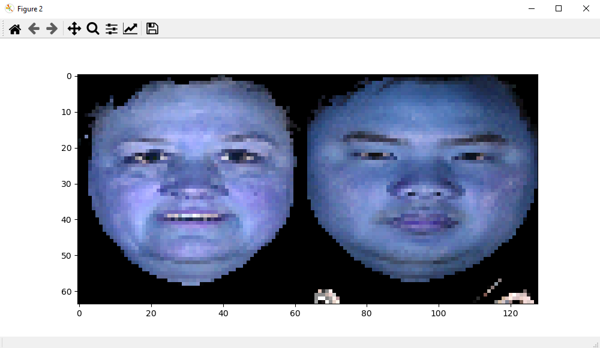
### Male Female ratio 
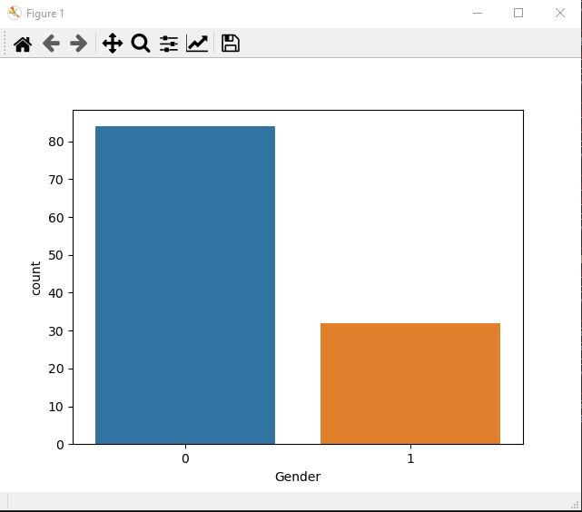
### Layers and parameters 
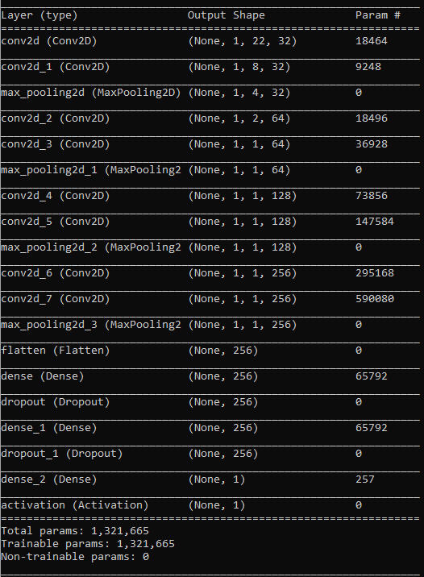
### Early stoping technique 
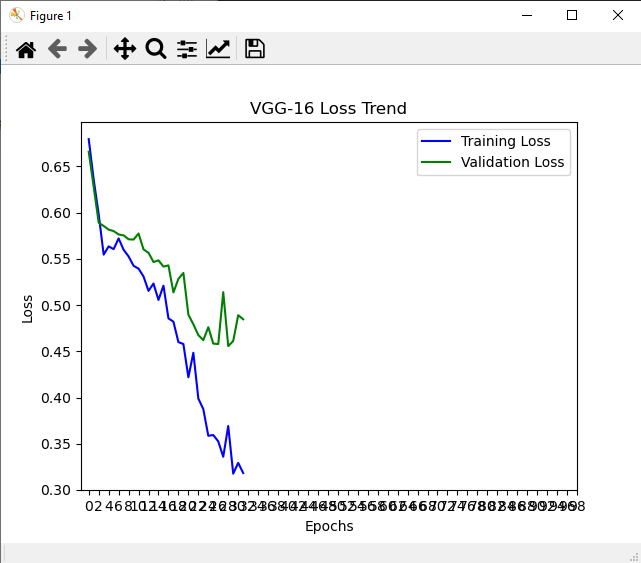
### Prediction 
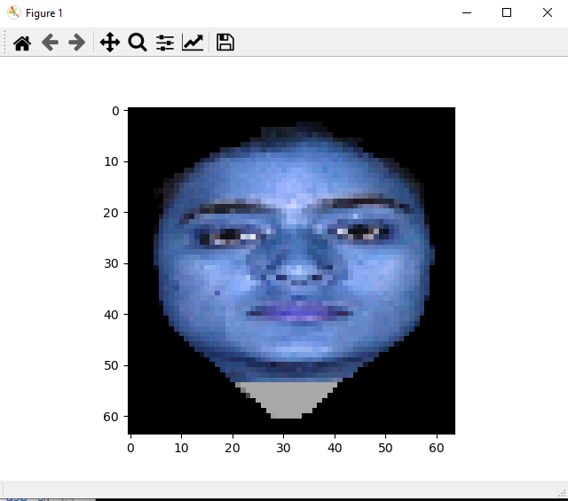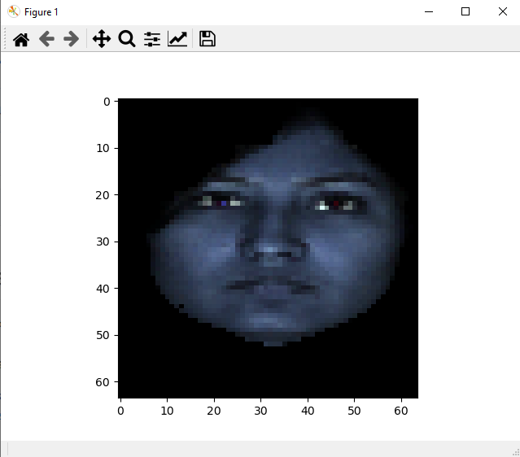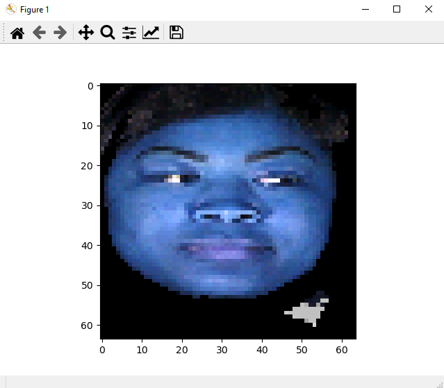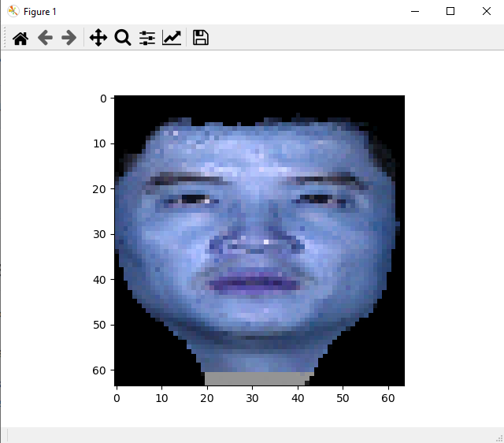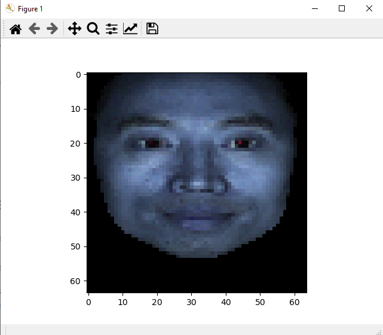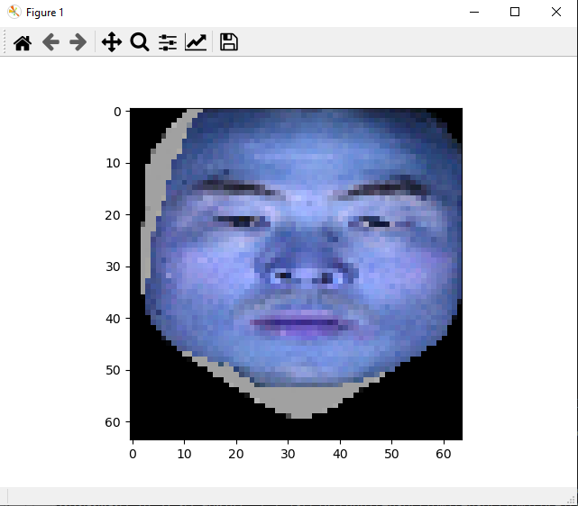
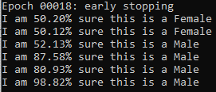
